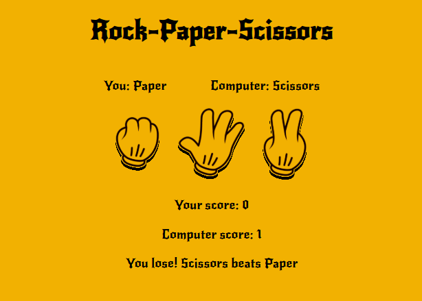

# Rock-Paper-Scissors

 

A basic rock paper scissors implementation with JavaScript that allows users to play against the computer.

## About

This project is part of the Foundations JavaScript section of [The Odin Project](https://www.theodinproject.com/lessons/foundations-rock-paper-scissors) curriculum.

## Features:

- User selection of rock, paper, or scissors
- Random computer selection
- Score tracking
- Game results display
